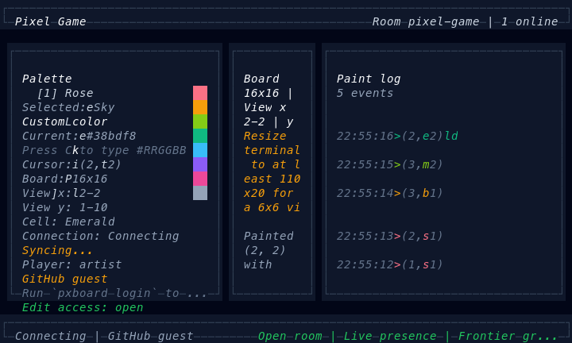

# PXPX

Terminal-native collaborative pixel board built with OpenTUI, React, and Yjs. This repository is open source and self-host friendly: it includes the terminal client, a Cloudflare Worker collaboration server, and local build and release scripts.

For a Korean-language overview, see [README.ko.md](./README.ko.md).



## Try It First

If the public SSH entrypoint is available, the fastest way to try the project is from a real terminal:

```bash
ssh pxpx.sh
ssh -t pxpx.sh facebook/react
ssh -t pxpx.sh torvalds/linux
```

`ssh pxpx.sh` is the default public entrypoint when the SSH gateway is available. You do not need a fixed SSH username such as `pxpx@`; the gateway accepts plain `ssh pxpx.sh` and ignores the presented SSH username. You can also jump straight into a repository-scoped room with any `owner/repo` slug, such as `torvalds/linux`. The rest of this README explains how to run and self-host the same stack from source.

## Open-source Scope

- Included and supported: terminal client, Cloudflare Worker, local build and release scripts
- Included as an advanced deployment option: SSH gateway in `src/ssh-gateway.ts`
- Out of scope for this repository: any maintainer-run shared worker or SSH host

## What It Supports

- Local multiplayer via `y-websocket` for development or self-hosted play
- Remote multiplayer via the Cloudflare Worker in this repository
- Room routing by explicit room name or GitHub `owner/repo` slug
- Live cursors, recent paint activity, short-lived paint highlights, and board growth on the south and east frontier
- Optional GitHub device login for identity labels and protected repository rooms
- Standalone binary builds and GitHub release packaging

## Prerequisites

- `pnpm`
- `bun`
- A Cloudflare account only if you want to run your own worker

If `pnpm` is not installed yet:

```bash
corepack enable
corepack prepare pnpm@10.13.1 --activate
```

## Quick Start

Install dependencies:

```bash
pnpm install
```

Start the local collaboration server:

```bash
pnpm dev:server
```

Start the client:

```bash
pnpm dev:client
```

By default the source checkout connects to `ws://127.0.0.1:1234` and joins room `pixel-game`.

Useful local variations:

```bash
pnpm dev:client -- facebook/react
PIXEL_NAME=alice pnpm dev:client
PIXEL_ROOM=design-review pnpm dev:client
```

Run a second client in another terminal to verify real-time sync.

## Worker-backed Features

Run the Worker locally with Wrangler:

```bash
pnpm dev:server:cloudflare
```

Then point gameplay and login at the local Worker:

```bash
PIXEL_SERVER_URL=ws://127.0.0.1:8787 pnpm dev:client
PIXEL_AUTH_SERVER_URL=ws://127.0.0.1:8787 pnpm dev:client -- login
```

Deploy your own Worker:

```bash
pnpm deploy:server:cloudflare
```

After deployment:

```bash
PIXEL_SERVER_URL=wss://<your-worker-url> pxboard owner/repo
PIXEL_AUTH_SERVER_URL=wss://<your-worker-url> pxboard login
```

## Install Options

Run directly from a checkout:

```bash
pnpm install
pnpm dev:server
pnpm dev:client
```

Install a local binary from this checkout:

```bash
./install.sh
```

`install.sh` uses `dist/pxboard` if it already exists, otherwise it builds a local binary from source when the checkout has `pnpm`, `bun`, and dependencies available.

The installed binary keeps the same defaults as the source build. Start a local server first or set `PIXEL_SERVER_URL` or `--server-url` to a deployed Worker before running `pxboard`.

Install from GitHub release assets:

```bash
curl -fsSL https://raw.githubusercontent.com/tolluset/pxpx/main/install.sh | sh
```

Override the default release source if you are running a fork:

```bash
curl -fsSL https://raw.githubusercontent.com/<owner>/<repo>/main/install.sh | PIXEL_GAME_REPO=<owner>/<repo> sh
```

## Common Commands

The installed binary is `pxboard`. From a source checkout, the equivalent pattern is `pnpm dev:client -- <args>`.

| Task | Installed binary | From source |
| --- | --- | --- |
| Play the default room | `pxboard` | `pnpm dev:client` |
| Join a repository room | `pxboard facebook/react` | `pnpm dev:client -- facebook/react` |
| Join a named room | `pxboard --room design-review` | `pnpm dev:client -- --room design-review` |
| Override player name | `pxboard --name alice` | `pnpm dev:client -- --name alice` |
| Start GitHub login | `pxboard login` | `pnpm dev:client -- login` |
| Show stored identity | `pxboard whoami` | `pnpm dev:client -- whoami` |
| Clear stored identity | `pxboard logout` | `pnpm dev:client -- logout` |
| Show repo access policy | `pxboard access status owner/repo` | `pnpm dev:client -- access status owner/repo` |
| Enable protected mode | `pxboard access enable owner/repo` | `pnpm dev:client -- access enable owner/repo` |
| Grant an editor | `pxboard access grant owner/repo alice` | `pnpm dev:client -- access grant owner/repo alice` |

Other project scripts:

```bash
pnpm build:client
pnpm dev:ssh-gateway
pnpm package:client:release
pnpm dev:server:cloudflare
pnpm deploy:server:cloudflare
pnpm typegen:worker
pnpm typecheck
```

## GitHub Login

Login is optional for open rooms. For repository rooms that have protected mode enabled, the owner and invited editors can paint while everyone else stays read-only.

```bash
pxboard login
pxboard whoami
pxboard logout
pxboard access status owner/repo
pxboard access enable owner/repo
pxboard access grant owner/repo alice
pxboard access revoke owner/repo alice
```

If you have a local or deployed Worker, point login at it:

```bash
pxboard login --server-url ws://127.0.0.1:8787
PIXEL_AUTH_SERVER_URL=wss://<your-worker-url> pxboard login
```

If the Worker login flow is unavailable, `pxboard login` can fall back to GitHub's device flow when `PIXEL_GITHUB_CLIENT_ID` or `GITHUB_CLIENT_ID` is set locally.

Successful Worker-backed logins also upsert the GitHub user profile into a server-side Durable Object-backed registry. The Worker still does not store GitHub access tokens.

Repository access management commands require a Worker-backed login because they depend on the Worker-signed session token.

## Cloudflare Worker

This repository includes a Durable Object-backed Yjs collaboration Worker in `cloudflare/worker.ts`.

Repository rooms also support an owner-managed protected mode. When enabled, editing is limited to the repository owner plus the invited editor list stored in the room Durable Object.

If you change `wrangler.toml` bindings, regenerate the Worker runtime declarations before typechecking:

```bash
pnpm typegen:worker
```

Run the Worker locally with Wrangler:

```bash
pnpm dev:server:cloudflare
```

Then point the client at the local Worker URL printed by Wrangler. A typical local URL is:

```bash
PIXEL_SERVER_URL=ws://127.0.0.1:8787 pnpm dev:client
PIXEL_AUTH_SERVER_URL=ws://127.0.0.1:8787 pxboard login
```

Deploy your own Worker:

```bash
pnpm deploy:server:cloudflare
```

Authenticate Wrangler with either `pnpm exec wrangler login` or `CLOUDFLARE_API_TOKEN` plus `CLOUDFLARE_ACCOUNT_ID`.

To enable Worker-backed GitHub login on your deployment:

```bash
pnpm exec wrangler secret put GITHUB_CLIENT_ID
pnpm exec wrangler secret put GITHUB_SESSION_SECRET
pnpm exec wrangler secret put ROOM_RESET_TOKEN
```

Then connect clients to the deployed Worker:

```bash
PIXEL_SERVER_URL=wss://<your-worker-url> pnpm dev:client
PIXEL_SERVER_URL=wss://<your-worker-url> pxboard facebook/react
```

To reset a room back to an empty 16x16 board:

```bash
curl -X POST \
  -H "Authorization: Bearer $ROOM_RESET_TOKEN" \
  https://<your-worker-url>/admin/rooms/pixel-game/reset
```

To paint a single pixel over HTTP:

```bash
curl -X POST \
  -H "Content-Type: application/json" \
  https://<your-worker-url>/api/rooms/tolluset%2Fpxpx/pixels \
  -d '{"x":0,"y":0,"color":"sky","playerName":"pxpx-bot"}'
```

The pixel API accepts palette ids such as `sky` or `rose`, plus custom colors like `#38bdf8`. Open rooms accept unauthenticated writes. Protected repository rooms require the same Worker GitHub session token used for websocket editing, sent as `Authorization: Bearer <token>` or `?github_auth=<token>`.

## SSH Gateway

This repository also includes a custom SSH gateway for hosted entrypoints. It is an advanced deployment option and not required for local development or self-hosting the Worker.

Example hosted entrypoints:

```bash
ssh pxpx.sh
ssh -t pxpx.sh facebook/react
```

Run it locally on a high port:

```bash
PXPX_GATEWAY_PORT=22222 \
PXPX_GATEWAY_HOST=127.0.0.1 \
PXPX_GATEWAY_HOST_KEYS=/tmp/pxpx-hostkey \
PXPX_GATEWAY_COMMAND=/usr/local/bin/pxboard \
PXPX_GATEWAY_RUN_AS_USER=pxpx \
PXPX_GATEWAY_RUN_HOME=/home/pxpx \
pnpm dev:ssh-gateway
```

The gateway accepts SSH public-key authentication, ignores the presented SSH username, launches only the configured board command, and stores GitHub auth state by SSH public-key fingerprint via `PIXEL_GITHUB_AUTH_FILE`.

## Build And Package

Build a standalone binary for the current OS and architecture:

```bash
pnpm build:client
./dist/pxboard facebook/react
```

Package the current platform binary as a GitHub release asset:

```bash
pnpm package:client:release
```

This creates:

- `dist/pxboard`
- `artifacts/pxboard-<os>-<arch>.tar.gz`
- `artifacts/pxboard-<os>-<arch>.tar.gz.sha256`

## Environment Variables

| Variable | Purpose | Default |
| --- | --- | --- |
| `PIXEL_SERVER_URL` | Gameplay websocket server URL | `ws://127.0.0.1:1234` |
| `PIXEL_AUTH_SERVER_URL` | GitHub login worker URL | `ws://127.0.0.1:8787` |
| `PIXEL_ROOM` | Explicit room name | `pixel-game` |
| `PIXEL_REPO` | Repository slug alias for the room | none |
| `PIXEL_NAME` | Player label override | stored GitHub login or random `player-xxxx` |
| `PIXEL_GITHUB_AUTH_FILE` | Override the stored GitHub auth session path | XDG config path under `~/.config/pxboard` |
| `PIXEL_GITHUB_CLIENT_ID` | Direct GitHub device-login fallback | none |
| `GITHUB_CLIENT_ID` | Same fallback, alternate name | none |
| `GITHUB_SESSION_SECRET` | Worker-side HMAC secret for signed GitHub sessions | none |
| `ROOM_RESET_TOKEN` | Worker-side bearer token for room reset operations | none |

Room selection precedence:

1. `--room`
2. Positional `owner/repo`
3. `--repo`
4. `PIXEL_ROOM`
5. `PIXEL_REPO`
6. `pixel-game`

## Controls

- `Arrow keys`, `WASD`, or `HJKL`: move the cursor
- `Enter`, `Space`, or left click: paint when editing is allowed
- `X`: clear the current cell when editing is allowed
- `1-8`: select a palette color
- `C`: open custom color input mode (`#RRGGBB`, `Enter` to apply, `Esc` to cancel)
- `Esc` or `Q`: quit

Painting or pushing beyond the south or east edge grows the shared board by `8` cells in that direction.

## Community

- [Contributing guide](./CONTRIBUTING.md)
- [Code of conduct](./CODE_OF_CONDUCT.md)
- [Security policy](./SECURITY.md)

## Related Docs

- [Client distribution notes](docs/2026-03-07-client-distribution.md)
- [Cloudflare server notes](docs/2026-03-07-cloudflare-server.md)
- [GitHub login notes](docs/2026-03-07-github-login.md)
- [Repository access control notes](docs/2026-03-08-repo-access-control.md)
- [SSH gateway architecture and deployment notes](docs/2026-03-08-ssh-gateway-spec.md)
- [Project plan](docs/2026-03-07-pixel-game-plan.md)
